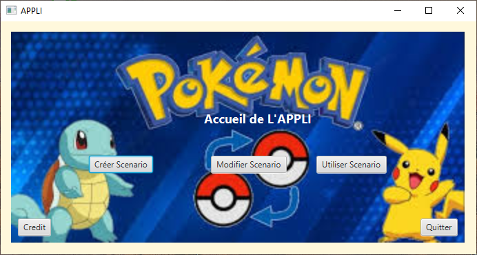
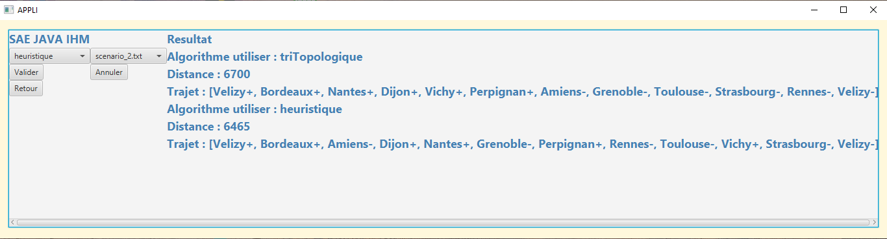

<div align="center">
  
</div>
<p align="center">
  👋 Bienvenue sur mon portfolio !  
  Vous découvrirez ici l’ensemble des projets que j’ai réalisés ces deux dernières années en  
  <strong>JAVA</strong>, <strong>PHP</strong>, <strong>PYTHON</strong>, <strong>HTML</strong>, <strong>CSS</strong> et <strong>PostgreSQL</strong>.  
  Bonne visite 🚀
</p>

<br><br>

<br><br>

---

# Optimisation d’itinéraire  
### Livraison Pokémon – Java

<p align="center">
  
</p>

## Présentation

Projet développé en Java dans le cadre d’un module d’exploration algorithmique.  
L’objectif était de modéliser un système de livraisons respectant des contraintes de précédence (vendeur → acheteur) tout en optimisant les distances parcourues.

---

## Approche technique

<p align="center">
  
</p>

- Modélisation par graphe orienté  
- Vérification des dépendances via tri topologique  
- Optimisation par algorithme A*  
- Calcul dynamique des distances  

---

## Structure

```bash
src/
 ├── Graphe.java
 ├── GrapheLivraison.java
 ├── LectureScenario.java
```

---

# Gestion de parc informatique  
### Application Web

<p align="center">
  
</p>

## Présentation

Application web permettant la gestion complète d’un parc informatique : inventaire, comptes utilisateurs, import de données et suivi du matériel.

---

## Fonctionnalités

<p align="center">
  
</p>

- Authentification sécurisée  
- Gestion des techniciens  
- Ajout / suppression de matériel  
- Import CSV  
- Consultation centralisée de l’inventaire  

---

## Technologies

HTML · CSS · JavaScript · Backend · Base de données SQL  

<br><br>

<div align="center">
  
</div>
